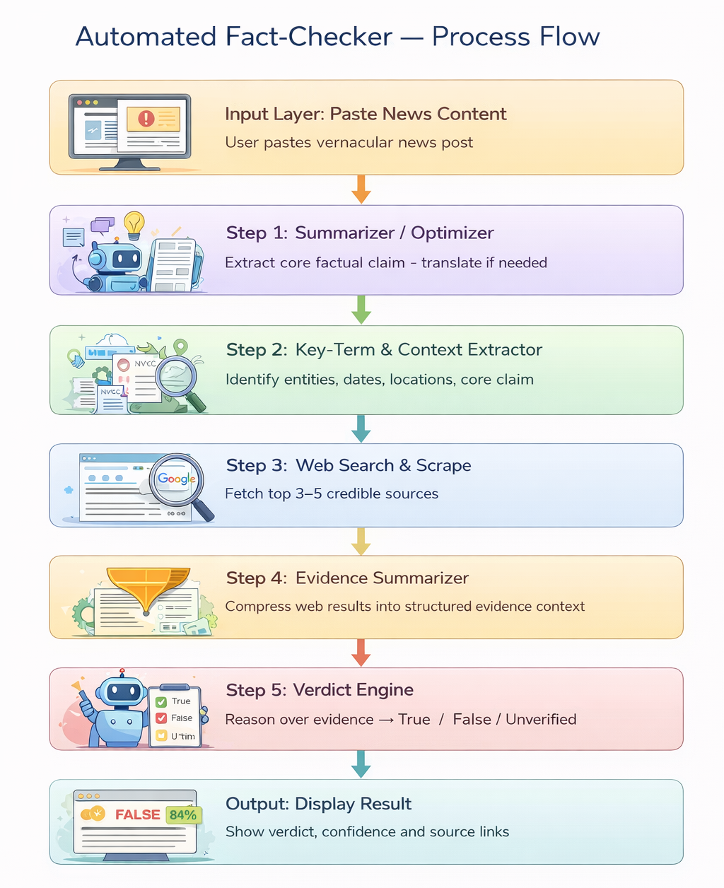
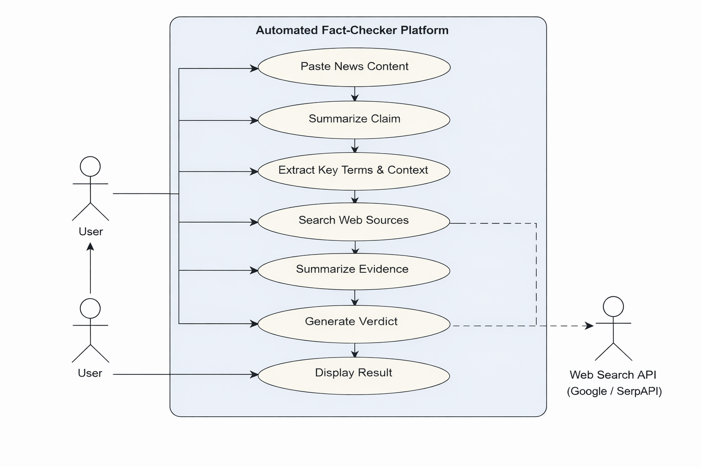

# 📘 Project Documentation  
## Automated Fact-Checker for Vernacular News

---

## 📌 Introduction
This project is designed to combat misinformation in Indian regional languages by leveraging AI and live web verification.

It processes raw user input and delivers a fact-check verdict using a structured 5-step pipeline.

---

## 🎯 Objective
- Detect misinformation in vernacular content  
- Provide real-time verification  
- Ensure high accuracy using pipeline optimization  

---

## 🧠 Core Concept: Pipeline Optimization

The system improves performance by:
- Removing unnecessary content early  
- Processing only the **core factual claim**  
- Reducing API and computation cost  

---

## 🔄 Process Flow Diagram



---

## 🔍 Detailed Pipeline Explanation

### 🔹 Step 1: Optimizer
- Translates vernacular text → English  
- Removes:
  - Emojis  
  - Hashtags  
  - Conversational fluff  
- Extracts a **single factual claim**

📁 File: `step1_optimizer.py`

---

### 🔹 Step 2: Key-Term Extractor
- Identifies:
  - Entities  
  - Dates  
  - Locations  
- Generates **2–3 search queries**

📁 File: `step2_keyterms.py`

---

### 🔹 Step 3: Web Search & Scraping
- Uses **SerpAPI** for search  
- Fetches top results  
- Scrapes content using **BeautifulSoup**

📁 File: `step3_search.py`

---

### 🔹 Step 4: Evidence Summarizer
- AI reads scraped data  
- Produces:
  - Supporting evidence  
  - Contradicting evidence  
  - Key facts  

📁 File: `step4_summarize.py`

---

### 🔹 Step 5: Verdict Engine
- Analyzes summarized evidence  
- Outputs:
  - Verdict (True / False / Unverified)  
  - Confidence score  
  - Explanation  
  - Source links  

📁 File: `step5_verdict.py`

---

## 🧩 Backend Working

- Built using **FastAPI**  
- Endpoint: `/api/check`  
- Orchestrates all pipeline steps  

📁 File: `backend/main.py`

---

## 👥 Use Case Diagram



---

## ⚖️ Comparison with Google Fact Check API

| Feature | Google API | Our System |
|--------|-----------|-----------|
| Data Source | Database | Live Web |
| Coverage | Limited | Unlimited |
| Vernacular Support | Low | High |
| Explanation | No | Yes |
| Breaking News | No | Yes |

---

## 📂 Folder Structure

```bash
fact-checker/
├── backend/
│   └── main.py
├── frontend/
│   └── index.html
├── pipeline/
│   ├── step1_optimizer.py
│   ├── step2_keyterms.py
│   ├── step3_search.py
│   ├── step4_summarize.py
│   └── step5_verdict.py
├── tests/
│   └── __init__.py
├── images/
│   ├── System_Architecture.jpeg
│   ├── Process-Flow.png
│   └── Use_Case_Diagram.png
├── README.md
├── Documentation.md
├── requirements.txt
└── render.yaml
```

---

## 🔑 API Requirements

- Gemini API Key  
- SerpAPI Key  

---

## ⚠️ Limitations

- Render cold start delay  
- API usage limits  
- Dependency on external services  

---

## ✅ Conclusion

This project provides a scalable, AI-driven solution to tackle misinformation in regional languages using:
- Real-time web verification  
- Intelligent pipeline design  
- Explainable AI outputs  

---

## 🔮 Future Improvements

- Add multilingual UI  
- Increase API efficiency  
- Integrate browser extension  
- Add user feedback system  
