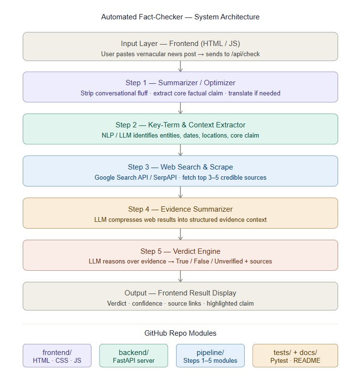

# 🧠 Automated Fact-Checker for Vernacular News

## 🌐 Live Demo
👉 https://ghoshsayan000.github.io/fact-checker/frontend/index.html

---

## 📌 Overview
The **Automated Fact-Checker for Vernacular News** is a web-based system that verifies news or social media content written in **any Indian language (Hindi, Bengali, Tamil, etc.)**.

It processes the input using an AI-powered pipeline and returns:
- ✅ Verdict: True / False / Unverified  
- 📊 Confidence Score  
- 🧾 Explanation  
- 🔗 Verified Source Links  

---

## 🚀 Key Features
- 🌍 Supports multiple Indian languages  
- ⚡ Real-time fact-checking using live web data  
- 🤖 AI-powered reasoning (Google Gemini)  
- 🔎 Web verification using SerpAPI  
- 📑 Structured evidence analysis  
- 📊 Confidence-based output  

---

## 🛠️ Tech Stack

### Frontend
- HTML  
- CSS  
- Vanilla JavaScript  

### Backend
- Python  
- FastAPI  

### AI & APIs
- Google Gemini (gemini-3-flash-preview)  
- SerpAPI (Google Search API)  

### Web Scraping
- BeautifulSoup4  

### Deployment
- Render (Backend)  
- GitHub Pages (Frontend)  

---

## 🏗️ System Architecture


---

## ⚙️ How It Works (Brief)

1. User inputs news content  
2. System extracts core claim  
3. Searches web for verification  
4. Analyzes evidence  
5. Generates verdict  

---

## 🔑 API Keys Required

- `GEMINI_API_KEY` → https://aistudio.google.com  
- `SERPAPI_KEY` → https://serpapi.com  

---

## ⚠️ Free Tier Limits

- Gemini API: ~10–12 requests/day  
- SerpAPI: 250 searches/month  
- Render: 750 hours/month  
- GitHub Pages: Unlimited  

---

## ⚠️ Known Limitations

- ⏳ First request delay (~50 sec due to Render sleep)  
- 🔒 API quota limits  
- 🔑 Requires fresh API keys for demo if exhausted  

---

## 📂 Project Folder Structure

```bash
fact-checker/
├── backend/
│   └── main.py
├── frontend/
│   └── index.html
├── pipeline/
│   ├── step1_optimizer.py
│   ├── step2_keyterms.py
│   ├── step3_search.py
│   ├── step4_summarize.py
│   └── step5_verdict.py
├── tests/
│   └── __init__.py
├── images/
│   ├── System_Architecture.jpeg
│   ├── Process-Flow.png
│   └── Use_Case_Diagram.png
├── README.md
├── requirements.txt
└── render.yaml
```


---

## ⭐ Why This Project?

Unlike traditional APIs like Google Fact Check:
- ❌ They rely on pre-existing databases  
- ✅ This system uses **live web search**  
- ✅ Works for **breaking & regional news**  
- ✅ Provides **AI-based reasoning**

---

## 👨‍💻 Developed By

Sayan Ghosh <br>
Suchetana Mukherjee <br>
Ritesh Kumar Singh
